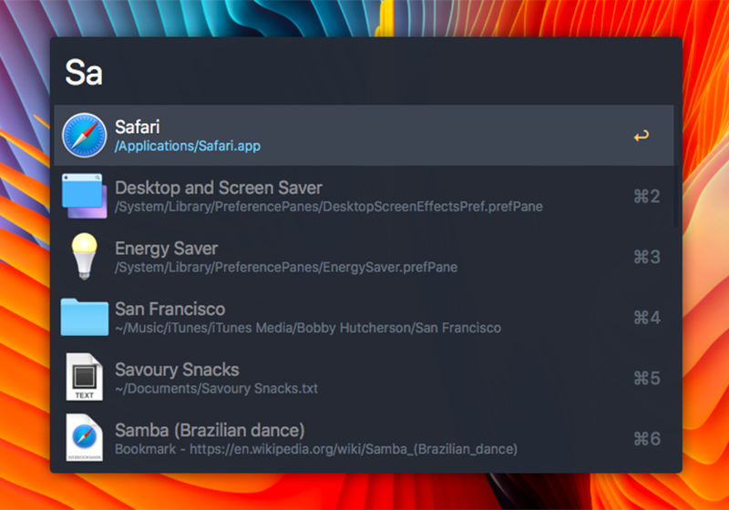
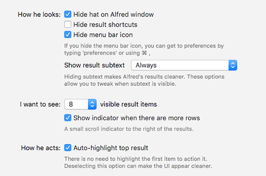

# alfred-ayu-mirage

> Simple, bright and elegant [Alfred](https://www.alfredapp.com/) theme based on the ayu mirage color scheme

## Install

**You need the [Powerpack](https://www.alfredapp.com/powerpack/) for custom themes**.

[Install the theme](https://www.alfredapp.com/extras/theme/DdJnAGOder/).

## Options

Use the following options to have it look exactly like in the screenshot above.

## Related

- [`ayu`](https://github.com/dempfi/ayu)
- [`ayu-colors`](https://github.com/ayu-theme/ayu-colors)

## License

MIT © [Michele Gerarduzzi](https://github.com/michelegera)
